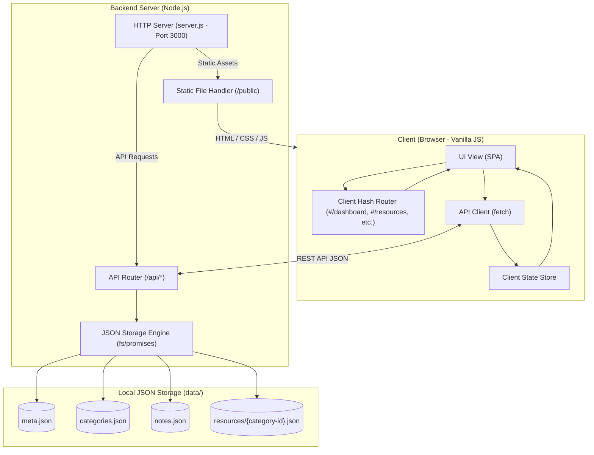

# 🗂️ Resource Organiser

A fast, lightweight, and modern local developer resource management web application with a glassmorphic UI and local JSON-backed storage.

---

## 📌 What It Is

**Resource Organiser** is a full-stack local web application designed to help developers, designers, and researchers organize developer tooling, documentation links, repositories, learning material, categories, and markdown/notes in one unified workspace.

It features:
- **Dashboard Overview**: Metrics, quick statistics, category distributions, and recent notes/resources.
- **Resource Management**: Bookmark and tag tools, repositories, and links grouped by category.
- **Categories System**: Custom category management with color accents, icons, and descriptions.
- **Notes & Cheatsheets**: Markdown-friendly quick note-taking linked to specific categories or standalone.
- **Local JSON Database**: All data is persisted directly in human-readable JSON files in the `data/` folder without requiring external database setups.

---

## 💡 Why To Use It

- 🚀 **Zero Heavy Dependencies**: Built with native Node.js and Vanilla Modern JavaScript (ES Modules). No bulky frameworks, build steps, or complicated setup.
- 💾 **Local-First & Data Ownership**: Your bookmarks, resources, and notes are stored locally on your machine in standard JSON files. Easy to back up, version control with Git, or edit manually.
- 🎨 **Modern Glassmorphic UI**: Thoughtfully crafted with CSS custom properties, glassmorphic panels, responsive sidebar navigation, modal dialogs, and smooth micro-interactions.
- ⚡ **Lightning Fast**: Sub-millisecond response times with direct filesystem read/writes and client-side hash routing (`#/dashboard`, `#/resources`, `#/categories`, `#/notes`).
- 🔍 **Instant Global Search**: Filter across all resources, categories, notes, and tags in real time.

---

## 🔄 How It Works

The architecture connects a Vanilla JS Single Page Application (SPA) to a lightweight Node.js HTTP server that manages the filesystem-backed JSON database.



### Request Flow
1. **Frontend Request**: The browser requests static assets (`index.html`, CSS, JS) from `http://localhost:3000`.
2. **Data Initialization**: The client calls `GET /api/data` to load all categories, resources, notes, and metadata into the client `store`.
3. **User Interaction / CRUD**:
   - Creating/updating/deleting categories, resources, or notes triggers asynchronous `POST`, `PATCH`, or `DELETE` requests to `/api/*`.
   - The server validates the request and atomically updates the appropriate JSON file in `data/`.
   - The client store updates and re-renders the active view without a full page reload.

---

## 📁 File Structure

```text
resources_organiser/
├── data/                             # JSON database storage
│   ├── categories.json               # Categories list with metadata
│   ├── meta.json                     # Application metadata and timestamps
│   ├── notes.json                    # Notes and snippets
│   └── resources/                    # Per-category resource files
│       ├── cat-repo.json
│       ├── cat-ui.json
│       └── ...
├── public/                           # Frontend assets (Static)
│   ├── css/                          # Modular styling
│   │   ├── base.css                  # CSS variables, typography, reset
│   │   ├── layout.css                # App shell, sidebar, topbar, grid
│   │   └── components.css            # Buttons, modals, cards, badges
│   ├── js/                           # ES Modules frontend logic
│   │   ├── api.js                    # Fetch wrapper for /api endpoints
│   │   ├── app.js                    # Main controller and event handlers
│   │   ├── renderers.js              # View renderers (Dashboard, Notes, etc.)
│   │   ├── router.js                 # Hash-based SPA routing
│   │   └── store.js                  # In-memory client state store
│   └── index.html                    # Single page HTML entry point
├── server.js                         # Native Node.js HTTP server & REST API
├── package.json                      # Project manifest and scripts
├── design.md                         # Design system specifications
└── README.md                         # Project documentation
```

---

## 🚀 How to Run

### Prerequisites
- [Node.js](https://nodejs.org/) (v16 or newer recommended)

### 1. Start the Server
Open your terminal inside the project directory and run:

```powershell
npm start
```

*Or run directly with Node:*
```powershell
node server.js
```

### 2. Access the Application
Open your browser and navigate to:

👉 **[http://localhost:3000](http://localhost:3000)**

> [!IMPORTANT]
> Always run via `npm start` (`http://localhost:3000`) rather than a simple static server like VS Code Live Server (`port 5500`), because the application requires the Node.js backend to handle `/api/*` endpoints and save your data to the `data/` directory.

---

## 🔄 GitHub Auto-Sync (Optional)

If you want changes made in the web app to automatically commit & push to your GitHub repository in the cloud:

Set the following environment variables (e.g. in your Render / Railway dashboard):

| Environment Variable | Example Value | Description |
|---|---|---|
| `GITHUB_TOKEN` | `ghp_xxxxxx` | GitHub Personal Access Token (Classic with `repo` scope) |
| `GITHUB_REPO` | `your-username/resources_organiser` | Repository target |
| `GITHUB_BRANCH` | `main` | Target branch (default is `main`) |

Whenever a category, resource, or note is added or updated, [`server.js`](file:///c:/MyProject/resources_organiser/server.js) will commit the updated JSON file directly to GitHub via the GitHub API.

---

## 🛠️ API Endpoints Summary

| Method | Endpoint | Description |
|---|---|---|
| `GET` | `/api/data` | Fetch all application data (categories, resources, notes, meta) |
| `POST` | `/api/categories` | Create a new category |
| `PATCH` | `/api/categories/:id` | Update an existing category |
| `DELETE` | `/api/categories/:id` | Delete a category and its resources |
| `POST` | `/api/resources` | Create a new resource |
| `PATCH` | `/api/resources/:id` | Update an existing resource |
| `DELETE` | `/api/resources/:id` | Delete a resource |
| `POST` | `/api/notes` | Create a new note |
| `PATCH` | `/api/notes/:id` | Update an existing note |
| `DELETE` | `/api/notes/:id` | Delete a note |
